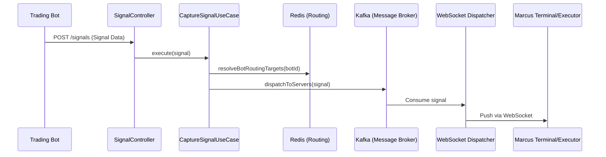

# 🚀 Signal Core Backend

The `signal-core-backend` is the heart of the Marcus Trading platform. It is responsible for ingesting, validating, and distributing trading signals from Bots to Local Executors in real-time.

## 🏗️ Architecture: Hexagonal (Clean Architecture)

The system is built using the **Clean Architecture** approach to ensure flexibility, testability, and a clear separation between business logic and technical infrastructure.

### Module Map

| Module | Responsibility | Key Technologies |
| :--- | :--- | :--- |
| **marcus-domain** | Core business models (`Signal`, `Bot`), domain services, and Port definitions. 100% POJO. | Pure Java, Lombok |
| **marcus-application** | Orchestrates Use Cases (e.g., `CaptureSignalUseCase`). Independent of frameworks. | Pure Java |
| **marcus-infrastructure** | Implements Domain Ports (Persistence, Messaging, Caching). | JPA, Kafka, Redis |
| **marcus-api** | REST API endpoints and WebSocket handlers for real-time dispatch. | Spring Boot, WebSocket |

---

## 🌊 Core Data Flow: Signal Pipeline

1.  **Ingestion**: Bot sends a signal via `POST /api/v1/signals` (Signed with HMAC-SHA256).
2.  **Validation & Persistence**: `CaptureSignalUseCase` validates the payload and saves it to PostgreSQL.
3.  **Intelligent Routing**: The system determines target subscribers and their active server instances via Redis.
4.  **Async Distribution**: The signal is pushed to the `trading-signals` Kafka topic.
5.  **Real-time Dispatch**: `SignalDispatchKafkaConsumer` on the target server instance broadcasts the signal to active WebSocket sessions.

---

## 🔌 Executor-Backend Communication

The Backend and Local Executor communicate via a persistent WebSocket connection:
- **Authentication**: Uses `wsToken` and HMAC-SHA256 handshake.
- **Single Session**: One active session per token (previous connections are kicked).
- **Bidirectional**: 
    - **Downward**: Signals and system ACKs.
    - **Upward**: `execution_event` (Order status) and `audit-push` (Balance snapshots).

---

## 🛠️ Tech Stack

- **Framework**: Spring Boot 3.x
- **Database**: PostgreSQL (JSONB for metadata)
- **Messaging**: Apache Kafka
- **Caching/Routing**: Redis
- **Standards**: MapStruct for object mapping, Spring Security for IAM.

---

## 📚 Further Documentation

- **[Business Flows](./docs/BUSINESS_FLOWS.md)**: Detailed Mermaid diagrams for IAM, Signal Fan-out, and Handshakes.
- **[Contributing & Coding Standards](./CONTRIBUTING.md)**: Rules for developers and PR guidelines.
- **[Knowledge Base](./docs/knowledge/)**: Best practices, DDD patterns, and repo structure.
- **[API Specification](./docs/openapi/marcus-trading-delta.yaml)**: OpenAPI/Swagger definition.

---

## ⚠️ Known Tech Debt & Risk Areas

- **Error Handling**: WebSocket dispatch retry mechanism needs improvement.
- **Scalability**: High connection counts may require Redis Pub/Sub for more efficient cross-instance dispatching.
- **Persistence Overlap**: Redundant synchronous/asynchronous write paths (partially resolved by removing Kafka storage consumer).
